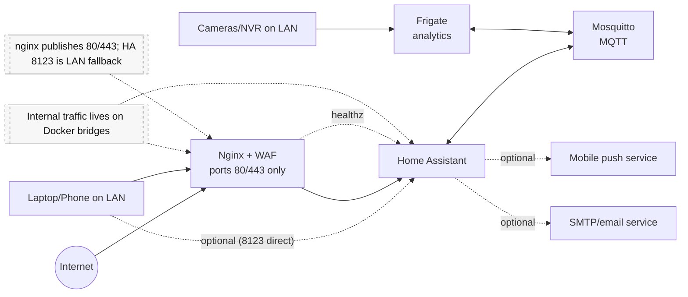

# Home Server Architecture - Home Assistant + Frigate + MQTT + Nginx/WAF

This document describes how the stack is laid out.

---

## Baseline

- **Host OS:** Ubuntu 24.04 LTS
- **Hardware:** Small form factor Intel box (e.g. Acer mini tower) with integrated GPU
  - VAAPI (`LIBVA_DRIVER_NAME=i965`) is used so Frigate can offload H.264/H.265 decode to the iGPU
- **Timezone:** host stays on UTC; Home Assistant and Frigate containers explicitly use `America/New_York`

---

## Stack Summary

The stack consists of four main services, all running in Docker:

- **Home Assistant:** central automation service and web UI
- **Frigate:** software video analytics/detection service (Docker) consuming RTSP camera substreams (in this setup, via an external NVR)
- **Mosquitto:** MQTT broker for event transport
- **Nginx + ModSecurity (OWASP CRS):** HTTPS termination, reverse proxy, and Web Application Firewall

Supporting pieces:

- **Dynu DDNS** for a stable public hostname (e.g. `<PUBLIC_HOSTNAME>`)
- **Let's Encrypt via ACME (DNS-01 with Dynu)** for TLS certificates
- **Systemd timers + shell/Python scripts** for:
  - Health checks
  - Backups/snapshots
  - Certificate renewals
  - Security audits (Trivy, Lynis)

### Diagram 

---

## Directory Layout

Everything is kept under the home directory of the service user:

- `ha/`
  - `docker-compose.yml` - defines all services, networks, volumes, healthchecks
  - `compose.sh` - wrapper that loads env files and calls `docker compose`
  - `nginx/` - nginx + ModSecurity config and SSL certs
  - `homeassistant/` - HA Dockerfile and configuration
  - `mosquitto/` - broker configuration, TLS certs, data, logs
  - `frigate/` - Frigate configuration and media storage
  - `acme/` - `acme.sh` home for DNS-01 cert issuance
- `scripts/` - health checks, snapshots, TLS renewal, email notification helpers
- `secrets/` - git-ignored env files:
  - `ha.env` - runtime settings and credentials for containers
  - `scripts.env` - secrets for host scripts (HA token, SMTP, etc.)
- `logs/` - logs from scripts (disk checks, health checks, audits)
- `snapshots/` - backup tarballs and health logs

The repo keeps code and configuration, secrets, logs, and backups in different directories. That makes it easier to publish the repo without exposing credentials.

---

## Network Layout and Access Limits

### Docker Bridges

Two bridge Docker networks act as private switches:

- `ha_net`
  - Connects `nginx` <-> `homeassistant`
  - `nginx` exposes ports `80/443` on the host
  - Home Assistant also exposes `8123` on the host for LAN-only fallback
- `frigate_bridge`
  - Connects `homeassistant` <-> `mosquitto` <-> `frigate`
  - MQTT and Frigate are never directly exposed to the host's WAN interface

**Design choice:** No container uses `network_mode: host`.  
This preserves isolation and makes it harder to accidentally expose internal services.

### Host Firewall (UFW)

- Default: `deny incoming`
- Allow:
  - `80,443/tcp` (nginx) from anywhere
  - `22/tcp` from LAN only for SSH
  - `8123/tcp` from LAN only for direct HA access (optional)
- No firewall rule opens MQTT externally; it remains internal to the Docker network.

### Trusted Proxies (Home Assistant)

Home Assistant's `configuration.yaml` defines `trusted_proxies` as:

- `127.0.0.1` / `::1`
- The subnets used by `ha_net` and `frigate_bridge`
- LAN CIDR from `LAN_SUBNET`

This means only nginx and known internal addresses can set `X-Forwarded-For`, so internet clients cannot send fake forwarded IPs.

### Who Can Reach What

- **Internal:** Docker bridge networks, HA/Frigate/Mosquitto containers, and LAN clients you control.
- **Exposed externally:** nginx, because it is the only service with host ports and can face the internet when external access is enabled.
- **Internet traffic:** requests coming from outside your network.
- **Main limits:** only nginx should be public; HA 8123 is LAN-only fallback; WAF blocks `/auth` and `/api`; DNS-01 avoids inbound challenge ports; `trusted_proxies` is scoped to loopback, Docker subnets, and the LAN CIDR.

---

## Components

### Nginx + ModSecurity (WAF)

Role:

- Reverse proxy on ports 80/443
- TLS termination with Let's Encrypt certs
- Security headers and rate limiting
- Web Application Firewall with OWASP CRS

Key behaviors:

- Rejects requests with wrong `Host` header using nginx 444, which closes the connection without a normal HTTP response
- Redirects valid HTTP requests to HTTPS with status `308`
- Adds HSTS, X-Frame-Options, X-Content-Type-Options, Referrer-Policy, Permissions-Policy
- Rate limits `/auth` and `/api` to slow brute force and abuse
- WAF in:
  - Blocking mode for `/`, `/auth`, and `/api` (excluding `/api/websocket`)
  - Detection-only for `/auth/login_flow`
  - Disabled for `/api/websocket` (WebSocket handshake)

Health:

- Provides `/healthz` on a loopback port that proxies to HA
- Docker healthcheck monitors this endpoint and marks `nginx` unhealthy if it fails

---

### Home Assistant

Role:

- Automation engine and primary web UI
- Reads MQTT events from Mosquitto (especially Frigate detections)
- Exposes internal API consumed via nginx

Security:

- `trusted_proxies` and `use_x_forwarded_for` configured to trust nginx and Docker networks only
- `ip_ban_enabled: true` and a low `login_attempts_threshold` for lockout
- CORS allowlist restricted to the external URL
- Runs as UID 1000 (non-root) to keep `/config` user-owned

Integrations:

- MQTT integration enabled in YAML, with broker host/TLS/credentials configured through the Home Assistant UI
- Frigate integration as a custom component
- HACS for additional community add-ons

Automations:

- Triggered by Frigate events (person detection)
- Capture snapshots to `/config/www/snapshots/...`
- Send mobile push notifications via per-user services `MY_PHONE` / `SOMEONE_ELSE_PHONE` (from env)
- Adjust Frigate motion sensitivity at sunrise/sunset via MQTT config topics

---

### Mosquitto (MQTT Broker)

Role:

- Message bus between Frigate (publisher) and Home Assistant (subscriber)

Configuration:

- Listener `8883` (TLS) for HA, Frigate, and other MQTT clients
  - Limited to the Docker network; not opened on the host firewall
- `allow_anonymous false` and password file for auth
- TLS certificates issued by a local CA managed by host script `renew_mosquitto_tls.sh`
  - CA private key kept outside container volumes

---

### Frigate (Detection)

Role:

- Connects to RTSP camera substreams (supplied by an existing NVR in this setup)
- Offloads H.264/H.265 decode to Intel iGPU (VAAPI)
- Runs CPU-based detections for `person`
- Publishes detection and occupancy events to MQTT

Configuration highlights:

- Uses lower-resolution streams (e.g. 640x480 @ 4 fps) to balance accuracy and resource usage
- Motion and object filters tuned to reduce false positives
- Snapshots and short motion clips retained for a few days
- MQTT credentials and RTSP credentials provided via env variables, not hard-coded in config

---

## Certificates & ACME

- Public hostname provided by Dynu DDNS (e.g. `<PUBLIC_HOSTNAME>`)
- TLS certificates obtained with `acme.sh` running inside a temporary Docker container using Dynu's DNS-01 API:
  - Works through NAT without opening port 80
- Certs installed into `ha/nginx/ssl/`:
  - `fullchain.pem`
  - `privkey.pem`
- Systemd timer `acme-renew.timer` runs hourly:
  - Executes `acme.sh --cron` inside a temporary Docker container directly from the unit
  - Installs any renewed certs
  - Reloads nginx

---

## Scripts, Health Checks, and Timers

Scripts in `~/scripts/`:

- `ha_eos_check.sh` - full check of Docker, nginx, HA, WAF, MQTT, firewall, ports, and disk
- `container_healthcheck.sh` - lightweight container and HTTP checks
- `server_healthcheck.sh` - wrapper that runs `ha_eos_check.sh`, logs to `snapshots/health`, and notifies on failure
- `server_make_snapshot.sh` - backup `/etc`, `~/ha`, and `~/scripts` into `snapshots/server/...`
- `renew_mosquitto_tls.sh` - local CA and server cert rotation for Mosquitto
- `notify_email.py` - SMTP helper for sending alerts

Timers:

- `server-healthcheck.timer` - runs `server_healthcheck.sh` every 30 minutes
- `acme-renew.timer` - runs ACME renewal hourly with jitter
- Weekly Trivy and Lynis run through cron jobs, not systemd timers.
